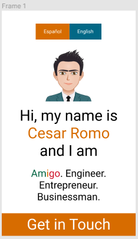

(English)
# Personal Portfolio
- [My Personal Website](romocesar.github.io) that showcases personal and team projects, business ventures, professional experience and skills I have acquired through practice.

## Main purposes

To present a condensed and thorough exposition of my craft and services.
To connect with employers, future partners and other fellow human beings.
To demonstrate my software engineering, design, marketing and branding skills thorugh my own portfolio.

## Installation

git clone this repository to create a website of yours based on my own.

## Website Design and Development Process

### Design Process:
Made with figma.com

- Mobile version v1.0.0

(Español)
